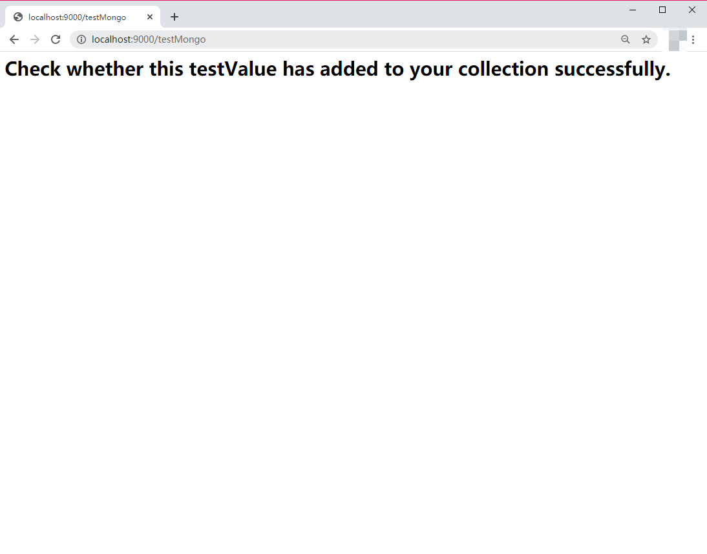

# Build Your First Play-MongoDB Project!

This project is a minimal version of Play! and I built it with **Scala** purely.

I just modified it based on **Play Scala Seed** and added a MongoDB module so that this project will be able to use **MongoDB** as your database!

AHHH,I am just a green hand and learning `scala`  now! but I hope that it will be of use to you if you want to build a sample web server with Scala too.

## Add MongoDB drivers to build.sbt

You'd better to make sure that  `scalaVersion`  in `build.sbt` is '2.12.x'.

```build,sbt
//scala Version : 2.12.x
scalaVersion := "2.12.1"

// Adds Json utils
libraryDependencies += "com.typesafe.play" %% "play-json" % "2.8.1"

// Adds driver for MongoDB
libraryDependencies += "cn.playscala" % "play-mongo_2.12" % "0.3.0"
addCompilerPlugin("org.scalamacros" % "paradise" % "2.1.0" cross CrossVersion.full)
```

If you want to see more details about `cn.playscala`,click here:

📦[Github tutorial](https://github.com/playcommunity/play-mongo)

## Config your MongoDB connection

replace this configuration with your own MongoDB connection.

```conf/application.conf
# config your own mongoDB source here.
# for instance => mongodb://${host}:${port}/${dataBaseName}
mongodb.uri = "mongodb://localhost:27017/studentDB"
```

and then, build a sample Controller in `/app/controllers` like this:

```scala
package controllers

import cn.playscala.mongo.Mongo
import javax.inject.{Inject, Singleton}
import play.api.mvc.{AbstractController, ControllerComponents}
import play.api.libs.json.{JsObject, Json}

@Singleton
class MongoDBController @Inject()(cc: ControllerComponents, mongo: Mongo) extends AbstractController(cc) {

  /**
    * You should config your 'mongodb.uri' in 'conf/application.conf' first!
    */
  def testMongo = Action{

    //try to insert "{"success":"0"}" into your mongoDB's collection.
    val testValue : JsObject = Json.obj("success"->0)

    //replace "test" with your own mongoDB's collection, or it will create a new collection named "test".
    mongo.collection("test").insertOne(testValue)

    Ok(views.html.result("Check weather this testValue has added to your collection successfully."))
  }
}
```

## Go start!

run this project, and access ` http://localhost:9000/testMongo` in your browser:


Don't forget to check your mongoDB whether you inserted it successfully:


Congratulations!


